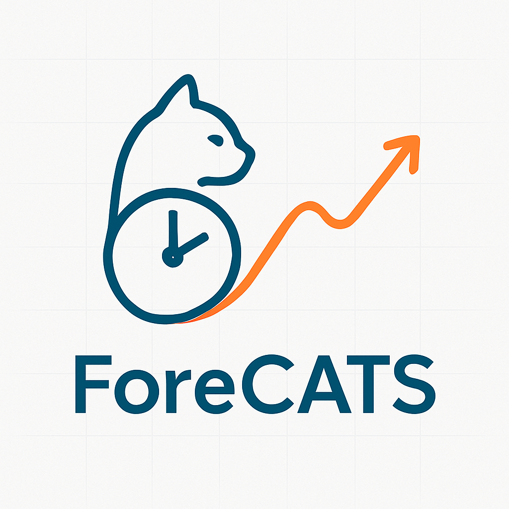
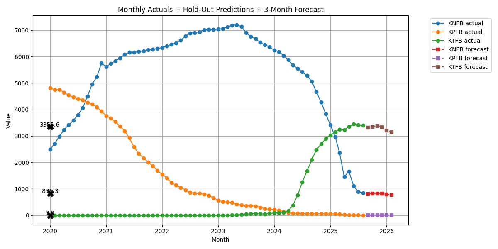

# 🐾 ForeCATS – Neural Forecasting for Time Series 

**ForeCATS** (Forecasting with Convolutional And Temporal Structures) is a Python-based project exploring **machine learning** and **deep learning** techniques for **time series forecasting**.  
It includes experiments with **PyTorch Temporal Convolutional Networks (TCN)**, data preprocessing utilities, and hyperparameter optimization workflows.

---

## 📌 Features
- **Temporal Convolutional Network (TCN)** implementation in PyTorch.
- **Data preprocessing** scripts for daily and monthly time series.
- **Interpolation** and missing value handling.
- **Hyperparameter tuning** with Optuna.
- Modular utilities for future forecasting experiments.
- Example datasets included for quick testing.

---

## 📂 Repository Structure
```
NeuralForecast4TimeSeries/
│
├── images/                  # Project images and diagrams
├── studies/                 # Experiment results and study files
├── TimeSeriesMonthlyData.csv
├── daily_data.csv
├── forecats_utils.py        # Utility functions
├── fut_forecats.py          # Future forecasting scripts
├── interpolate_data.py      # Data interpolation
├── nf_tcn.py                 # NeuralForecast TCN model
├── pt_tcn.py                 # PyTorch TCN implementation
├── tune_opt_forecats.py     # Optuna tuning script
├── requirements.txt         # Dependencies
└── my_study.db              # Optuna study database
```
A few info
#### 📊 Optuna's Results are saved in a sqlite DB my_study.db
#### 📈 for forecast see fut_forecats.py
#### 🐾 see also the different forecats implementations: nf_tcn.py , pt_tcn.py
#### 🧠 Optuna “Model evaluation" is started (or continued) with tune_opt_forecats.py
---

## 🚀 Getting Started

### 1️⃣ Clone the repository
```
git clone https://github.com/carloderossi/NeuralForecast4TimeSeries.git
cd NeuralForecast4TimeSeries
```

### 2️⃣ Install dependencies
```
pip install -r requirements.txt
```

### 3️⃣ Run a new Optuna study
```
new_study.cmd
```

### 4️⃣ Run a forecast with the winning model
```
python fut_forecats.py
```

## 📊 Example Output chart


---

## 🛠 Technologies Used
- **Python 3.x**
- **PyTorch**
- **Optuna**
- **Pandas / NumPy**
- **Matplotlib / Seaborn**

---

## 📜 License
This project is licensed under the MIT License.

---

## 🙌 Acknowledgements
- Inspired by research on **Temporal Convolutional Networks** for sequence modeling.
- Thanks to the open-source ML community for tools and datasets.

